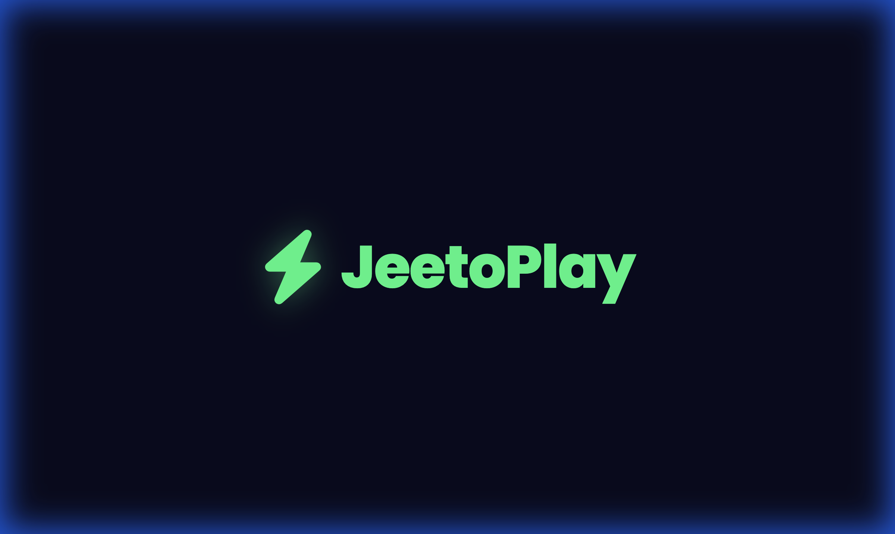
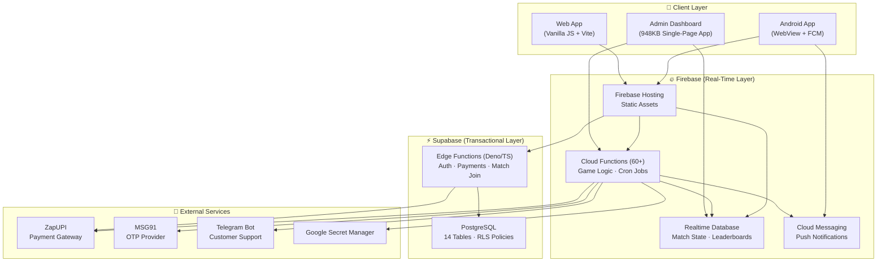

<div align="center">
  

  <h1>🎮 JeetoPlay</h1>
  <p><strong>Production-Grade Real-Money Gaming & Esports Platform</strong></p>
  <p><em>4,000+ users in 72 hours · Hybrid Firebase + Supabase architecture · 60+ serverless functions</em></p>

  <p>
    
    
    
    
    
  </p>
</div>

---

## 💡 The Story: Surviving a ₹45,000 Cloud Bill

Within 72 hours of launching, JeetoPlay went viral — scaling to **4,000 active users**. The initial architecture relied entirely on Firebase Realtime Database (RTDB) and Cloud Functions for everything: wallets, matchmaking, leaderboards, and authentication.

**What broke:** Thousands of concurrent RTDB listeners combined with Cloud Function cold-starts triggered an explosion of billable operations, resulting in a **₹45,000 Firebase bill in just 3 days**.

**How I fixed it:** I re-architected the entire platform under production pressure:

| Component | Before (Firebase-only) | After (Hybrid) |
|---|---|---|
| Authentication (OTP) | Firebase Auth + Cloud Functions | **Supabase Edge Functions** |
| Wallet Ledger | Firebase RTDB listeners | **Supabase PostgreSQL** |
| Payment Processing | Cloud Functions only | **Supabase Edge Functions** |
| Match State (real-time) | Firebase RTDB | Firebase RTDB *(kept — best for this)* |
| Scheduled Jobs | Cloud Functions | Cloud Functions *(kept)* |

**Result:** 99% cost reduction while improving stability, latency, and transaction integrity.

> This project demonstrates real-world problem-solving at scale — not just writing code, but surviving production fires and making hard architectural decisions under pressure.

---

## 🏗️ System Architecture



---

## 🚀 Feature Breakdown

### 💰 Financial System
- **Atomic Two-Tier Wallet** — Separate `depositBalance` and `winningBalance` with strict deduction ordering (deposit first, then winnings). Prevents race conditions via transactional reads/writes.
- **Payment Gateway Integration** — ZapUPI webhook processing with idempotent deposit crediting, auto-check polling, and manual admin confirmation fallback.
- **Withdrawal Processing** — Configurable platform fees with real-time net-amount previews. Admin approval/rejection flow with automatic refund-to-deposit on rejection.
- **Deposit Bonus System** — Configurable percentage-based bonuses (e.g., "Get 10% extra up to ₹50") that stack independently with VIP rewards.

### 🎮 Gaming Modules
- **Esports Matches** — BGMI/Free Fire match hosting with slot booking, room credential distribution, kill-based + placement scoring, and automated prize distribution.
- **Ludo (3 Modes):**
  - *Challenge Mode* — 1v1 with room code sharing, screenshot-based result verification, and 3-button dispute resolution (Won/Lost/Dispute)
  - *AI Mode* — Single-player matches against configurable AI opponents
  - *PvP Real-Time* — Live multiplayer with Firebase-synced game state
- **Tournament System** — Lobby and Bracket elimination formats with auto-registration close, round reminders, and placement-based prize distribution with tiebreaker logic.

### 🔔 Engagement & Retention
- **Smart Notification Engine** — Automated re-engagement system (43KB of logic) with behavioral triggers: inactive users, abandoned deposits, match reminders, streak alerts.
- **Daily Login Rewards** — 7-day streak system with escalating rewards and streak-break recovery.
- **Spin Wheel / Lucky Draw** — Configurable prize segments with weighted probability and cooldown timers.
- **VIP Membership** — Premium tier with bonus multipliers, priority support badges, and exclusive rewards.
- **Coupon System** — Admin-created promo codes with usage limits, expiry dates, and per-user redemption tracking.
- **Referral Program** — Unique referral codes with automatic bonus crediting on referee's first deposit. Dedicated referral leaderboard.
- **Watch & Earn (Ad Rewards)** — Rewarded ad integration with rate limiting and anti-abuse validation.

### 🛡️ Admin & Operations
- **Full Admin Dashboard** — 948KB single-page admin panel with real-time control over users, matches, transactions, disputes, platform settings, and analytics.
- **Moderator Role System** — Granular permissions with time-windowed result update access (12-hour window).
- **Telegram Support Bot** — NLP-powered customer support bot with intent detection and automated FAQ responses.
- **9 Scheduled Cron Jobs** — Dispute auto-escalation, match reminders, stale match expiry, re-engagement campaigns, VIP expiry checks, tournament lifecycle management.

---

## 🔒 Security Architecture

| Layer | Implementation |
|---|---|
| **Database Rules** | 268-line Firebase RTDB ruleset with user-isolated reads, admin-gated writes, and validated state machine transitions |
| **Row-Level Security** | Supabase RLS on all 14 tables — public reads for matches/games, user-scoped reads for wallets/transactions |
| **Secret Management** | Zero hardcoded keys — Google Secret Manager for Cloud Functions, Supabase Vault for Edge Functions |
| **Balance Protection** | Server-side only balance mutations; client writes validated against `>= 0` constraints with admin bypass |
| **Rate Limiting** | Dedicated `rate_limits` node with complete client lockout (`.read: false, .write: false`) |
| **State Validation** | Enum-validated status transitions on matches (e.g., Ludo: `OPEN → PAIRED → ROOM_SHARED → IN_PROGRESS → COMPLETED`) |

---

## 📂 Project Structure

```
JeetoPlay/
├── functions/                    # Firebase Cloud Functions (Backend)
│   ├── index.js                  # Entry point — re-exports 60+ functions
│   ├── payments.js               # Payment gateway, deposits, withdrawals (62KB)
│   ├── ludo.js                   # Ludo game logic, disputes, rematch (48KB)
│   ├── smart_notifications.js    # Automated engagement engine (43KB)
│   ├── scheduled.js              # 9 cron jobs (34KB)
│   ├── tournament.js             # Lobby + Bracket tournaments (27KB)
│   ├── admin.js                  # Admin operations, bans, disputes (22KB)
│   ├── helpers.js                # Shared utilities — deductBalance, sendPush (23KB)
│   ├── notifications.js          # FCM push, topics, broadcasts (15KB)
│   ├── triggers.js               # DB triggers — match/withdrawal/user events (12KB)
│   ├── telegram-bot.js           # Telegram support bot (10KB)
│   ├── esports.js                # Esports match join logic (9KB)
│   ├── ludo-pvp.js               # Real-time PvP multiplayer (8KB)
│   ├── coupons.js                # Coupon system (11KB)
│   ├── spin_wheel.js             # Lucky draw (7KB)
│   ├── earn_ads.js               # Watch & Earn (7KB)
│   ├── ludo-ai.js                # AI opponent mode (5KB)
│   ├── daily_rewards.js          # Login streak rewards (5KB)
│   ├── vip.js                    # VIP membership (5KB)
│   ├── referrals.js              # Referral program (4KB)
│   ├── otp.js                    # OTP verification (4KB)
│   └── bot/                      # Telegram bot NLP + handlers
│       ├── nlp.js
│       └── handlers.js
│
├── supabase/functions/           # Supabase Edge Functions (Deno/TypeScript)
│   ├── verify-otp/index.ts       # OTP authentication
│   ├── create-payment/index.ts   # Payment order creation
│   ├── payment-webhook/index.ts  # Webhook processing
│   └── join-match/index.ts       # Match join with balance check
│
├── public/                       # Frontend (Firebase Hosted)
│   ├── index.html                # Landing page (53KB)
│   ├── app.html                  # Main application shell (153KB)
│   ├── admin_panel.html          # Admin dashboard (948KB)
│   ├── ludo-game.html            # Ludo game board
│   ├── js/                       # Client-side modules
│   │   ├── auth.js               # Authentication flow
│   │   ├── wallet.js             # Wallet UI + transactions
│   │   ├── deposit.js            # Deposit flow + bonus preview
│   │   ├── esports.js            # Esports match browsing/joining
│   │   ├── tournament.js         # Tournament registration
│   │   ├── ludo.js               # Ludo lobby + matchmaking
│   │   ├── leaderboard.js        # Multi-category leaderboards
│   │   ├── spin_wheel.js         # Spin wheel animations
│   │   ├── smart_notifications.js# Notification center
│   │   ├── firebase-init.js      # Firebase SDK initialization
│   │   └── supabase-init.js      # Supabase client initialization
│   └── css/app.css               # Application styles
│
├── migration/                    # Firebase → Supabase migration tools
│   ├── schema.sql                # PostgreSQL schema (14 tables, 16 indexes, RLS)
│   ├── migrate.js                # Data migration script
│   └── upload-images.js          # Asset migration
│
├── database.rules.json           # Firebase RTDB security rules (268 lines)
├── storage.rules                 # Firebase Storage security rules
└── firebase.json                 # Firebase project configuration
```

---

## 🛠️ Tech Stack

| Category | Technologies |
|---|---|
| **Frontend** | Vanilla JavaScript (ES6+), HTML5, CSS3, Vite |
| **Backend** | Node.js, Firebase Cloud Functions (2nd Gen) |
| **Edge Compute** | Supabase Edge Functions (Deno / TypeScript) |
| **Databases** | Firebase Realtime Database, Supabase PostgreSQL |
| **Mobile** | Android (Java) — WebView wrapper with native FCM integration |
| **Payments** | ZapUPI Gateway with webhook + polling verification |
| **Messaging** | Firebase Cloud Messaging (FCM), Telegram Bot API |
| **Auth** | MSG91 OTP via Supabase Edge Functions |
| **Security** | Google Secret Manager, Supabase Vault, Firebase DB Rules, PostgreSQL RLS |
| **DevOps** | Firebase Hosting, Firebase CLI, Supabase CLI |

---

## 📊 Codebase Stats

| Metric | Count |
|---|---|
| Cloud Functions | 60+ |
| Supabase Edge Functions | 4 |
| Scheduled Cron Jobs | 9 |
| Database Triggers | 4 |
| Firebase RTDB Security Rules | 268 lines |
| PostgreSQL Tables | 14 |
| PostgreSQL Indexes | 16 |
| RLS Policies | 14 |
| Backend Code | ~350KB |
| Admin Dashboard | 948KB (single file) |

---

## 💻 Local Development

```bash
# Clone
git clone https://github.com/Rajesh81s/JeetoPlay.git
cd JeetoPlay

# Install Cloud Functions dependencies
cd functions && npm install && cd ..

# Configure environment
# 1. Set up .firebaserc with your project ID
# 2. Configure Firebase Functions secrets via: firebase functions:secrets:set KEY_NAME
# 3. Set Supabase secrets in supabase/.env.secrets

# Run locally
firebase emulators:start

# Deploy
firebase deploy
```

---

## 📝 License

This project is proprietary software. All rights reserved.

© 2025-2026 JeetoPlay. Unauthorized copying, modification, or distribution is prohibited.
